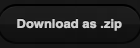

**Instructeurs:** 
[Sandra Cortijo](mailto:sandra.cortijo@cnrs.fr), 
[Mathieu Ingouff](mailto:Mathieu.Ingouff@ird.fr)

## Description 

Ce cours va vous apprendre comment explorer des données de RNA-seq avec **R**. 

Afin de pouvoir faire ce cours sur votre ordinateur, téléchargez le matériel du cours en cliquant sur  et dézippez le dossier téléchargé. Ce dossier contient le matériel vous permettant de mettre en pratique le cours.

 

### Vous travaillerez en groupe de 2 ou 3 pour l'ensemble de cette matière afin d'identifier des gènes différentiellement exprimés, d'effectuer un clustering de ces gènes et d'explorer un des clusters que vous avez identifié.

 

----
**ATTENTION!! Il est attendu que vous ayez un niveau entre débutant et intermédiaire en R pour pouvoir suivre convenablement ce cours.**  
**Si vous ne pensez pas avoir un niveau de R assez avancé, faites [cette formation en ligne](https://scortijo.github.io/2023_L3_R/) avant la première séance (environ une dizaine d'heures requises).**   

----

 

## Les différentes séances sont (avec accès au cours):

### Séance 1 (lundi 23 septembre, 11h30-13h, salle 5.129): Vérification des données

Dans cette séance, vous allez effectuer les premières étapes nécessaires avant la détection de gènes différenciellement exprimés: la vérification de la qualité des données.   

[Matériel Vérification des données](seance1/materiel/Verification_Donneees.html)  

 

### Séance 2 (lundi 23 septembre, 13h15-14h45, salle 5.129): Détection de gènes différentiellement exprimés

Dans cette séance vous allez détecter les gènes différentiellement exprimés entre chaque paire de conditions dans nos données.  

[Matériel DEseq](seance2/materiel/DEseq.html)  

 

### Séance 3 (mardi 24 septembre, 9h45-11h15, salle 5.127): Clustering des gènes 

Dans cette séance vous allez détecter des clusters de gènes avec des expressions similaires dans les différentes conditions

[Matériel clustering des gènes](seance3/materiel/clustering.html)  

 

### Séance 4 (mardi 24 septembre, 11h30-13h, salle 5.127): Exploration des clusters et design de primers pour la validation en laboratoire

Dans cette séance vous allez analyser plus en détail l'un des clusters identifiés à la séance précédente.

[Matériel Exploration des clusters](seance4/materiel/Validation_clusters.html)  

 

 

## Modalités d'évaluation

**L'évaluation de cette matière va se faire par une présentation orale des résultats que votre groupe aura obtenu**

 

---

 

## Pour utiliser R sur votre ordinateur: 
Il est recommandé d'installer **R** et **R studio** sur votre ordinateur afin de pouvoir travailler en autonomie pendant et entre les séances. 

[Installer R](https://cran.biotools.fr/)

[Installer Rstudio](https://rstudio.com/products/rstudio/download/)

Dans chaque cas, téléchargez la version pour votre système opérateur (Mac, Windows ou Linux) et installez les programmes normalement.

Vous devez aussi avoir les packages `tidyverse`, `visdat`, `scTenifoldNet`, `factoextra`, `gplots`, `matrixStats`, `RColorBrewer` et `DESeq2` installés. 
Pour cela:
1. Assurez vous d'avoir accès à internet
2. Ouvrez Rstudio
3. Dans la "console" (panel en haut à gauche), tapez `install.packages(c("tidyverse","visdat", "scTenifoldNet", "factoextra", "gplots", "matrixStats", "RColorBrewer"))` puis enter
4. Pour `DESeq2` installez en tapant dans la "console" 
`install.packages("BiocManager")` puis enter (sauf si BiocManager est déjà installé sur votre Rstudio)
`BiocManager::install("DESeq2")` puis enter
4. Assurez vous que l'installation a fonctionné en tapant `library(tidyverse)` (puis faites la même chose avec les autres libraries)
5. Le message affiché doit être similaire à la capture d'écran ci-dessous (pour `tidyverse`). Si vous avez un message du type: 
"Error in library(tidyverse): there is no package called 'tidyverse'"
**contactez un des instructeurs**.

