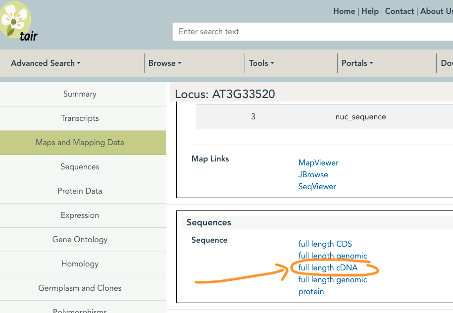

```{r setup, include=FALSE}
knitr::opts_chunk$set(echo = TRUE)
```


<br>
<br>

Dans cette séance, vous allez effectuer une étude plus approfondi du cluster que vous avez sélectionné. L'obectif est de définir les fonctions biologiques associées aux gènes présent dans ce cluster. Connaissant la réponse transcriptionnelle à l'azote et à la mutation *arp6-1* de ces gènes, cela nous permet de mieux comprendre les voies de régulation qui sont impliquées.  

Dans un deuxième temps, vous allez dessiner des primers pour des gènes d'intérêt appartenant à ce cluster. En effet, il est imporant de valider les données de RNAseq par une autre méthode dans une expérience indépendante. Cela se fait généralement par RT-qPCR. Dessiner des primers pour ce gène permettra aussi d'étudier sa réponse transcriptionnelle à d'autres conditions nevironnementales ou mutants.


# Etude des fonctions biologiques dans le cluster d'intérêt


Une première méthode pour étudier la fonction biologique des gènes d'un cluster est de regarder l'enrichissement en `Gene Ontology (GO)`. Chaque gène est associé à plusieurs GO qui indiquent les fonctions dans lesquelles il est, ou est possiblement, impliqué. L'étude d'enrichissement on GO consiste à définir si une GO est statistiquement plus enrichie dans notre groupe de gènes (venant d'un cluster) par rapport à un groupe témoin. Ce groupe témoin peut être l'ensemble des gènes du génome, les gènes sur lesquels l'analyse d'expression différentielle a été effectuée ou l'ensemble des gènes différentiellement exprimés utilisés pour le clustering. 


> Effectuez une analyse d'enrichissement en GO pour votre cluster en utilisant l'outil [ShinyGO](http://bioinformatics.sdstate.edu/go/).   

**Pour cela suivez les indications en image ci dessous**

`Etape1`


<br>

`Etape2`


<br>

`Etape3`


<br>

`Etape4`


<br>


> Quelles GO retrouvez vous comme enrichies?   

> Faite la même analyse en utilisant deux groupes de gènes témoin différents: (1) tous les gènes du génome et (2) tous les gènes différentiellement exprimés. Est-ce que cela change le résultat?

<br>

Cette étude d'enrichissement en GO donne une première idée des fonctions associées à notre cluster. Pour regarder plus en détail la fonction des gènes, téléchargez le tableau de résultat. Cela vous donne accés aux gènes dans chacune des GO trouvées enrichies dans le cluster.

<br>

Vous pouvez maintenant faire des recherches sur les GO et les gènes en vous aidant des outils suivant pour voir si leur présence dans ce cluster est logique avec leur expression en réponse au nitrate et à la mutation arp6-1, ou peut nous apprendre quelque chose sur le rôle possible de H2A.Z dans la nutrition azotée.  

Outils:   
- [Pubmed](https://pubmed.ncbi.nlm.nih.gov/) pour rechercher de la bibliographie en lien entre la GO ou un gène et la nutrition azotée et/ou H2A.Z.   
- [TAIR](https://www.arabidopsis.org/) pour regarder plus en détail la fonction d'un gène.   
- [Bar u-toronto](https://bar.utoronto.ca/) pour regarder plus en détail l'expression d'un gène dans différentes parties de la plante ou différentes conditions.    
- [Browser épigénomique](https://jbrowse.arabidopsis.org/?data=Araport11&loc=Chr1%3A26334566..26341735&tracks=TAIR10_genome%2CA11-GL%2CA11-PC%2CSALK_tDNAs%2Cchip_leaf-h2az%2CTAIR10_loci%2CTAIR10_genes%2Cmethyl_leaf&highlight=) pour regarder la présence de H2A.Z


# Design de primers pour des gènes d'intérêt du cluster

L'étape suivante consiste à dessiner des primers pour des gènes d'intérêt afin de les étudier en RT-qPCR.   


> Dessinez des primers pour un gène qui vous parait intéressant à la lumière de l'analyse au dessus en suivant les étapes suivantes.   


- Récupérez la séquence du transcrit pour ce gène sur [TAIR](https://www.arabidopsis.org/):  

  
<br>

- Utilisez cette séquence pour dessiner les primers sur le site [Primer3](https://primer3.ut.ee/) avec les critères suivants:   
  - Une taille de primers optimale à 20 et comprise en 18 et 23   
  - Un Tm des primers optimal à 60 et compris entre 58 et 62   
  - Un pourcentage en GC optimal à 50%   
  - Une taille des produits de PCR entre 100 et 200 (nous voulons des produits courts pour la qPCR)   
  - Si possible dessinez des primers dans la partie 3' du gène   
 
<br>

- Utilisez l'outil  [Net Primer](https://https://www.premierbiosoft.com/netprimer/) pour selectionner des gènes avec un score suppérieur à 90 (score de 0 à 100). Il vous faudra créer un compte gratuit pour l'utiliser.  

- Utilisez le site [Primer BLAST](https://www.ncbi.nlm.nih.gov/tools/primer-blast/index.cgi) afin de vérifier que les primers n'amplifient bien qu'une seule région du génome.   

<br>

**Une fois toutes ces étapes finies, vous avez vos primers!**


---

**A FAIRE POUR L'EVALUATION**


